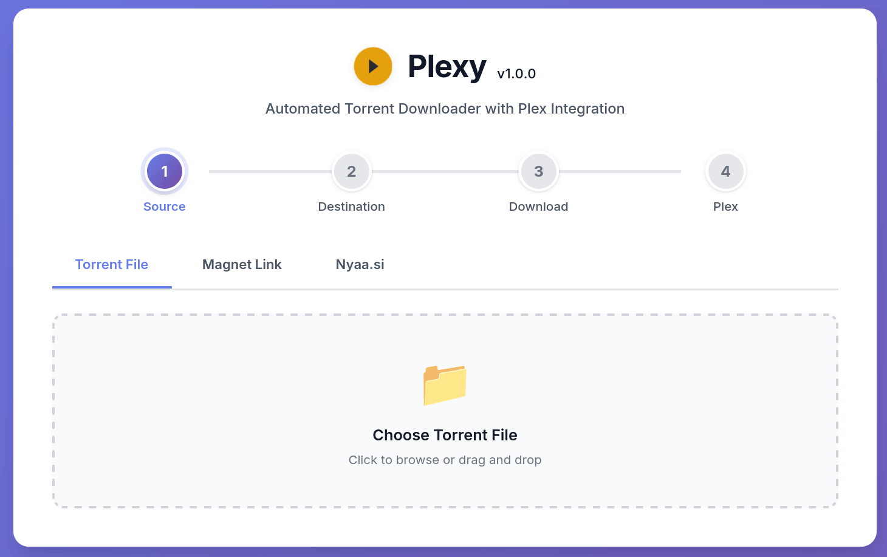
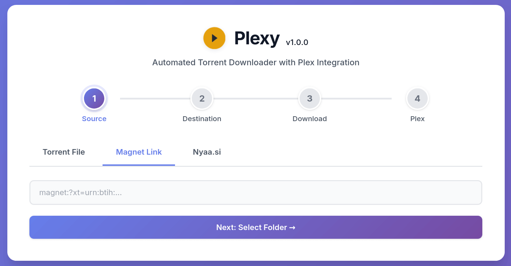
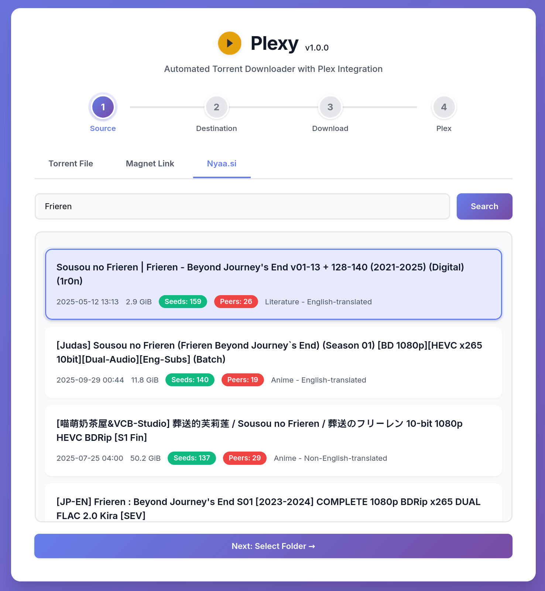
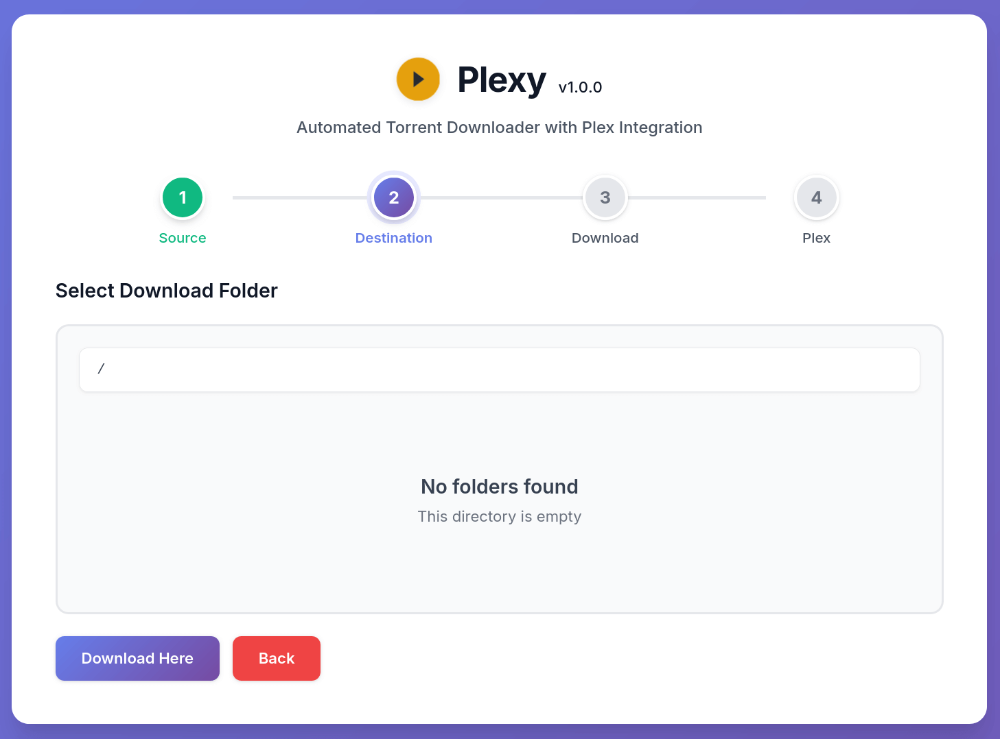
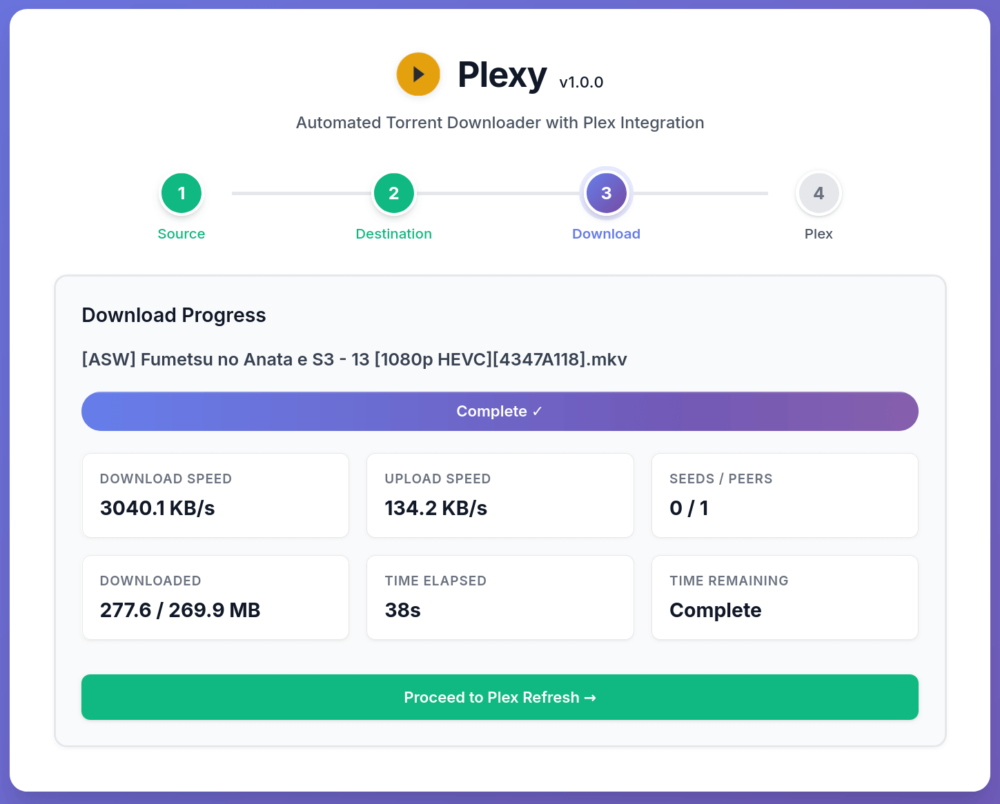
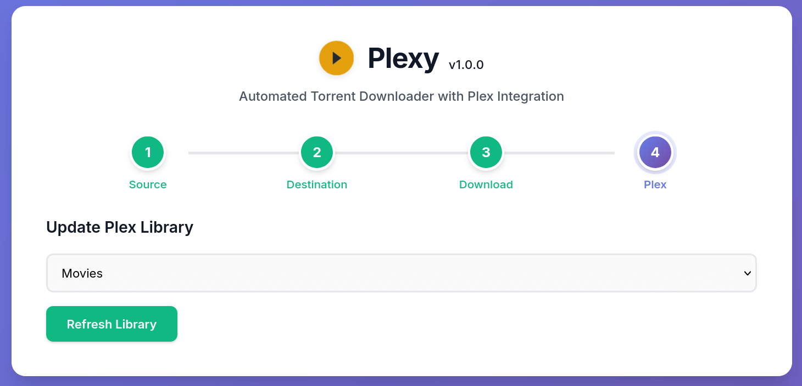
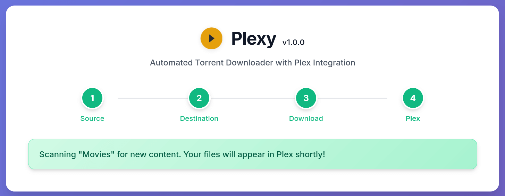

<div align="center">

<h1 align="center">Plexy</h1>
</div>

<p align="center">
<a href="https://github.com/polius/plexy/releases"></a>&nbsp;<a href="https://hub.docker.com/r/poliuscorp/plexy"></a>
</p>

<br>

<p align="center">
<b>Plexy</b> is a lightweight web application for downloading torrents with integrated Nyaa.si search and automatic Plex library refresh.
</p>

<br>

<details>
<summary>Expand this to see screenshots</summary>

| Page | Screenshot |
| --- | --- |
| 1.1. Source - Torrent |  |
| 1.2. Source - Magnet Link |  |
| 1.3. Source - Nyaa.si |  |
| 2. Destination |  |
| 3. Download |  |
| 4. Plex (Select) |  |
| 5. Plex (Done) |  |

</details>

## Features

- Add torrent via torrent file, magnet link or search Nyaa.si
- Browse and select download folder dynamically
- Real-time download progress tracking
- Cancel downloads with automatic cleanup
- Automatically refresh Plex library when complete

## Installation

The recommended installation method is **Docker**.

#### Run with Docker CLI

```bash
docker run -d \
  --name plexy \
  -p 8000:8000 \
  -v /path/to/your/plex/media:/downloads \
  -e PLEX_URL=http://host.docker.internal:32400 \
  -e PLEX_TOKEN=YOUR_PLEX_TOKEN_HERE \
  poliuscorp/plexy
```

- The `-v` flag mounts your Plex media folder where torrents will be downloaded.
- Replace `/path/to/your/plex/media` with the folder on your host where you want Plexy to download torrents.

#### Run with Docker Compose

```yaml
services:
  plexy:
    image: poliuscorp/plexy
    container_name: plexy
    restart: unless-stopped
    ports:
      - "8000:8000"
    volumes:
      - /path/to/your/plex/media:/downloads
    environment:
      - PLEX_URL=http://host.docker.internal:32400
      - PLEX_TOKEN=YOUR_PLEX_TOKEN_HERE
```

Once deployed, access it through your browser:

[http://localhost:8000](http://localhost:8000)

## Environment Variables

Plexy supports the following environment variables:

| Variable | Sample Value | Details |
| --- | --- | --- |
| PLEX_URL | http://host.docker.internal:32400 | URL of your Plex server (use host.docker.internal if Plex is on host) |
| PLEX_TOKEN | YOUR_PLEX_TOKEN_HERE | Plex authentication token for library refresh |

Get your Plex token: https://support.plex.tv/articles/204059436-finding-an-authentication-token-x-plex-token/